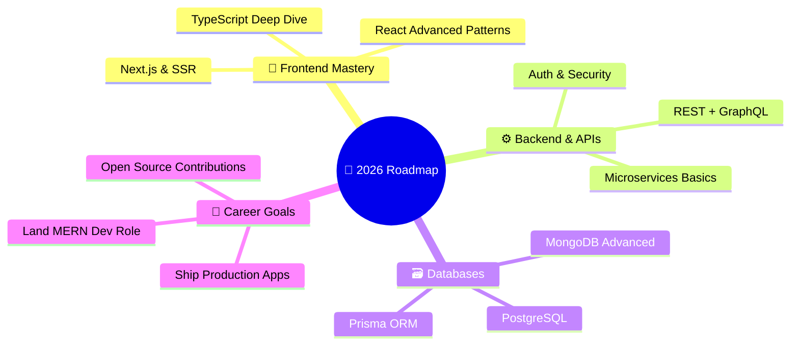

<!-- ╔══════════════════════════════════════════════════════════════════════╗ -->
<!-- ║                     ✦ ANIRBAN BANERJEE ✦                           ║ -->
<!-- ║              GitHub Profile — Built Different.                      ║ -->
<!-- ╚══════════════════════════════════════════════════════════════════════╝ -->

<!-- ▀▀▀▀▀▀▀▀▀▀▀▀▀▀▀▀▀▀▀▀  HERO BANNER  ▀▀▀▀▀▀▀▀▀▀▀▀▀▀▀▀▀▀▀▀ -->

<div align="center">

  

</div>

<!-- ▀▀▀▀▀▀▀▀▀▀▀▀▀▀▀▀▀▀▀▀  TERMINAL INTRO  ▀▀▀▀▀▀▀▀▀▀▀▀▀▀▀▀▀▀▀▀ -->

<br/>

<table align="center" border="0" cellpadding="0" cellspacing="0">
<tr>
<td width="55%" valign="top">

```js
// ✦ about_anirban.js

const anirban = {
    pronouns: "He" | "Him",
    title: "MERN Stack Developer",
    stack: ["MongoDB", "Express", "React", "Node.js"],
    education: "B.Tech 2025 Graduate 🎓",
    location: "India 🇮🇳",
    
    currentlyBuilding: "Full Stack Web Apps",
    exploring: ["TypeScript", "Prisma", "System Design"],
    
    philosophy: {
        code: "Clean > Clever",
        ui: "Pixel-perfect or nothing",
        backend: "Scalable & Secure",
        growth: "Ship fast, learn faster"
    },
    
    funFact: "I mass console.log and I'm proud 😤🍋🌶️"
};
```

</td>
<td width="45%" align="center" valign="top">

<br/>


<br/><br/>

<a href="mailto:anirbanbanerjee481@gmail.com">
  
</a>
<br/>
<a href="https://linkedin.com/in/anirban-banerjee-7a131224a/">
  
</a>
<br/>
<a href="https://github.com/aevilop">
  
</a>

<br/><br/>


</td>
</tr>
</table>

<br/>

<!-- ▀▀▀▀▀▀▀▀▀▀▀▀▀▀▀▀▀▀▀▀  DIVIDER  ▀▀▀▀▀▀▀▀▀▀▀▀▀▀▀▀▀▀▀▀ -->


<!-- ▀▀▀▀▀▀▀▀▀▀▀▀▀▀▀▀▀▀▀▀  TECH STACK  ▀▀▀▀▀▀▀▀▀▀▀▀▀▀▀▀▀▀▀▀ -->

<h2 align="center">
  
  &nbsp; Tech Arsenal
</h2>

<p align="center"><i>Battle-tested. Not just listed.</i></p>

<br/>

<h3 align="center">🎨 Frontend</h3>
<p align="center">
  <a href="#"></a>
</p>

<h3 align="center">⚙️ Backend & Database</h3>
<p align="center">
  <a href="#"></a>
</p>

<h3 align="center">🛠️ DevTools & Deployment</h3>
<p align="center">
  <a href="#"></a>
</p>

<br/>

<details>
<summary align="center"><b>📋 Detailed Breakdown (click to expand)</b></summary>
<br/>
<div align="center">

| Layer | Technologies |
|:---|:---|
| **🖥️ Languages** | `JavaScript` · `TypeScript` · `HTML5` · `CSS3` |
| **⚛️ Frontend** | `React.js` · `TailwindCSS` · `Bootstrap` |
| **🔧 Backend** | `Node.js` · `Express.js` |
| **🗄️ Databases** | `MongoDB` · `MySQL` |
| **🚀 Deployment** | `Vercel` · `Render` · `Netlify` |
| **🧰 Tools** | `Git` · `GitHub` · `VS Code` · `Postman` · `Vite` |

</div>
</details>

<br/>

<!-- ▀▀▀▀▀▀▀▀▀▀▀▀▀▀▀▀▀▀▀▀  DIVIDER  ▀▀▀▀▀▀▀▀▀▀▀▀▀▀▀▀▀▀▀▀ -->


<!-- ▀▀▀▀▀▀▀▀▀▀▀▀▀▀▀▀▀▀▀▀  CODER + COFFEE  ▀▀▀▀▀▀▀▀▀▀▀▀▀▀▀▀▀▀▀▀ -->

<h2 align="center">
  
  &nbsp; Code. Coffee. Repeat.
</h2>

<br/>

<table align="center" border="0" cellpadding="0" cellspacing="0">
<tr>
<td align="center" width="33%">
  
  <br/><br/>
  <b>👨‍💻 Writing Code</b>
  <br/>
  <sub>Where bugs become features</sub>
</td>
<td align="center" width="33%">
  
  <br/><br/>
  <b>☕ Fueled by Coffee</b>
  <br/>
  <sub>Daily caffeine intake: ██████░░ 75%</sub>
</td>
<td align="center" width="33%">
  
  <br/><br/>
  <b>📚 Always Learning</b>
  <br/>
  <sub>Currently: Full Stack Journey</sub>
</td>
</tr>
</table>

<br/>

<div align="center">

```
           ██████╗ ██████╗ ███████╗███████╗███████╗███████╗
          ██╔════╝██╔═══██╗██╔════╝██╔════╝██╔════╝██╔════╝
          ██║     ██║   ██║█████╗  █████╗  █████╗  █████╗  
          ██║     ██║   ██║██╔══╝  ██╔══╝  ██╔══╝  ██╔══╝  
          ╚██████╗╚██████╔╝██║     ██║     ███████╗███████╗
           ╚═════╝ ╚═════╝ ╚═╝     ╚═╝     ╚══════╝╚══════╝
                ☕ turns mass coffee → mass commits
```

</div>

<br/>

<!-- ▀▀▀▀▀▀▀▀▀▀▀▀▀▀▀▀▀▀▀▀  DIVIDER  ▀▀▀▀▀▀▀▀▀▀▀▀▀▀▀▀▀▀▀▀ -->


<!-- ▀▀▀▀▀▀▀▀▀▀▀▀▀▀▀▀▀▀▀▀  CURRENT FOCUS  ▀▀▀▀▀▀▀▀▀▀▀▀▀▀▀▀▀▀▀▀ -->

<h2 align="center">
  🚀 What I'm Locked In On
</h2>

<br/>

<div align="center">



</div>

<br/>

<!-- ▀▀▀▀▀▀▀▀▀▀▀▀▀▀▀▀▀▀▀▀  DIVIDER  ▀▀▀▀▀▀▀▀▀▀▀▀▀▀▀▀▀▀▀▀ -->


<!-- ▀▀▀▀▀▀▀▀▀▀▀▀▀▀▀▀▀▀▀▀  WEEKLY DEV BREAKDOWN  ▀▀▀▀▀▀▀▀▀▀▀▀▀▀▀▀▀▀▀▀ -->

<h2 align="center">
  ⏱️ Weekly Dev Breakdown
</h2>

<p align="center"><i>A typical week in my developer life.</i></p>

<br/>

<div align="center">

```text
🖥️ Frontend (React/JS)    ████████████████████░░░░░   78.5%
⚙️ Backend (Node/Express)  ██████████░░░░░░░░░░░░░░░   42.3%
🗄️ Database (MongoDB)      ██████░░░░░░░░░░░░░░░░░░░   25.0%
🐛 Debugging               █████████████░░░░░░░░░░░░   52.0%
☕ Coffee Breaks            █████████████████████████   100%
```

</div>

<br/>

<p align="center">
  
</p>

<p align="center">
  <samp>↑ Live footage of me during a production deploy ↑</samp>
</p>

<br/>

<!-- ▀▀▀▀▀▀▀▀▀▀▀▀▀▀▀▀▀▀▀▀  DIVIDER  ▀▀▀▀▀▀▀▀▀▀▀▀▀▀▀▀▀▀▀▀ -->


<!-- ▀▀▀▀▀▀▀▀▀▀▀▀▀▀▀▀▀▀▀▀  DEV QUOTE  ▀▀▀▀▀▀▀▀▀▀▀▀▀▀▀▀▀▀▀▀ -->

<h2 align="center">💭 Dev Wisdom</h2>

<br/>

<p align="center">
  
</p>

<br/>

<!-- ▀▀▀▀▀▀▀▀▀▀▀▀▀▀▀▀▀▀▀▀  DIVIDER  ▀▀▀▀▀▀▀▀▀▀▀▀▀▀▀▀▀▀▀▀ -->


<!-- ▀▀▀▀▀▀▀▀▀▀▀▀▀▀▀▀▀▀▀▀  CONNECT  ▀▀▀▀▀▀▀▀▀▀▀▀▀▀▀▀▀▀▀▀ -->

<h2 align="center">🤝 Let's Build Something Together</h2>

<br/>

<p align="center">
  <a href="mailto:anirbanbanerjee481@gmail.com">
    
  </a>
  &nbsp;&nbsp;
  <a href="https://linkedin.com/in/anirban-banerjee-7a131224a/">
    
  </a>
  &nbsp;&nbsp;
  <a href="https://github.com/aevilop">
    
  </a>
</p>

<br/>

<!-- ▀▀▀▀▀▀▀▀▀▀▀▀▀▀▀▀▀▀▀▀  UNIQUE FOOTER  ▀▀▀▀▀▀▀▀▀▀▀▀▀▀▀▀▀▀▀▀ -->


<br/>

<div align="center">

```
  ╔══════════════════════════════════════════════════════════════════╗
  ║                                                                  ║
  ║   █▀▄▀█ █▀▀ █▀█ █▄░█   █▀ ▀█▀ ▄▀█ █▀▀ █▄▀                    ║
  ║   █░▀░█ ██▄ █▀▄ █░▀█   ▄█ ░█░ █▀█ █▄▄ █░█                    ║
  ║                                                                  ║
  ║            MongoDB  ·  Express  ·  React  ·  Node               ║
  ║                                                                  ║
  ║   ┌─────────────────────────────────────────────────────────┐    ║
  ║   │  🟢 Status: Open to Opportunities                      │    ║
  ║   │  📍 Location: India                                    │    ║
  ║   │  ☕ Coffee Count Today: Math.floor(Math.random() * 5)   │    ║
  ║   │  💻 Currently: Building something awesome...            │    ║
  ║   └─────────────────────────────────────────────────────────┘    ║
  ║                                                                  ║
  ║        ⭐ If my code helped you, star a repo —                   ║
  ║          it costs nothing but means everything.                  ║
  ║                                                                  ║
  ╚══════════════════════════════════════════════════════════════════╝
```

</div>

<p align="center">
  
</p>
